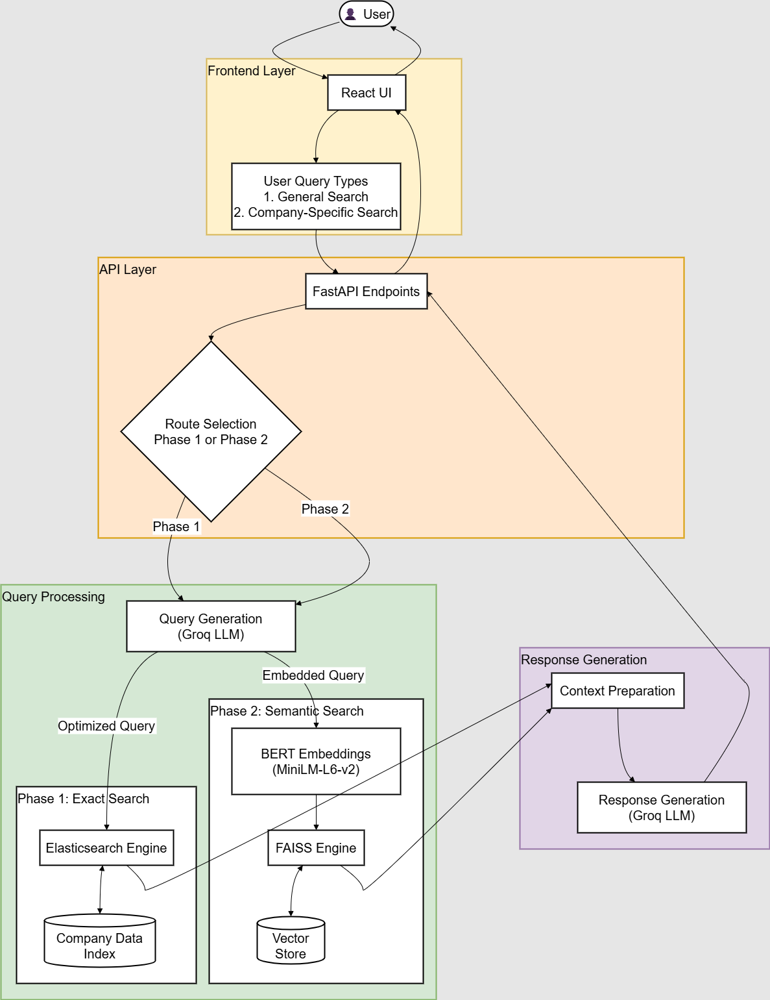
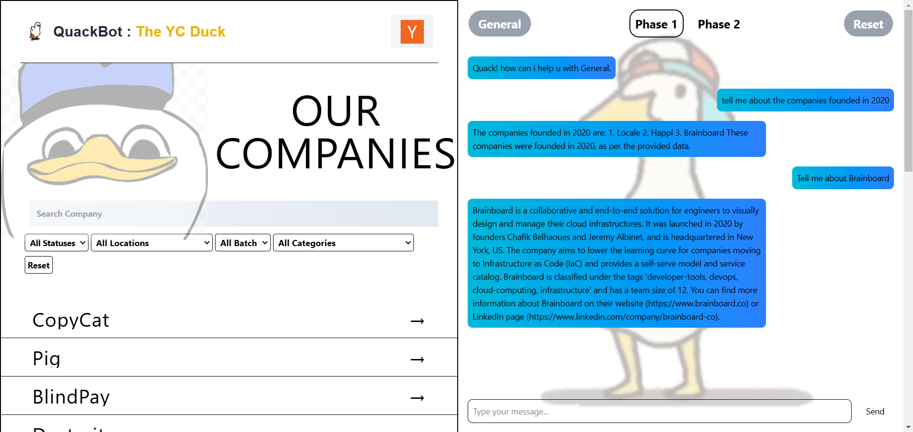

# YC Scout 🚀

An intelligent RAG-powered (Retrieval-Augmented Generation) search and chatbot system for Y Combinator companies, leveraging state-of-the-art LLM technology. Built with a powerful FastAPI backend featuring FAISS and Elasticsearch for semantic search, integrated with Llama-3.3-70B through Groq for advanced natural language processing, and a modern React frontend for seamless user interaction.


## 📋 System Overview


*High-level architecture showing the integration of RAG, FAISS, Elasticsearch, and Llama-3.3-70B*

## 🌟 Key Features

### 🤖 AI & ML Capabilities
- RAG (Retrieval-Augmented Generation) architecture for accurate, context-aware responses
- Integration with Llama-3.3-70B through Groq for state-of-the-art language processing
- Dual-phase semantic search using FAISS (Facebook AI Similarity Search) and Elasticsearch
- BERT embeddings for advanced semantic understanding
- Hybrid search architecture combining dense and sparse retrievals

### ⚡ Backend Technology
- FastAPI for high-performance async operations
- Vector similarity search with FAISS
- Full-text search capabilities with Elasticsearch
- Containerized deployment with Docker
- Enterprise-grade CORS security

### 🎯 Frontend Innovation
- Modern React application with hooks and context
- Real-time search functionality
- Interactive AI chat interface
- Dynamic company information display
- Responsive Material Design



*YC Scout's intuitive interface showing company search and chat capabilities*

## 🔧 Technical Stack

### 🧠 AI/ML Stack
- Llama-3.3-70B (via Groq)
- BERT Embeddings
- FAISS Vector DB
- Elasticsearch

### 🔄 Backend Stack
- Python 3.12.6
- FastAPI
- Docker
- Groq API
- Vector Databases

### 💫 Frontend Stack
- React 18+
- Vite
- Material UI
- Axios
- Modern JavaScript

## 🚀 Setup Guide

### Prerequisites
- Docker and Docker Compose
- Node.js 18+ and npm
- Python 3.12.6
- Groq API key
- Elasticsearch 8.x

### Backend Setup
```bash
cd backend

# Create and activate virtual environment
python -m venv venv
source venv/bin/activate  # On Windows: venv\Scripts\activate

# Install dependencies
pip install -r requirements.txt

# Configure environment variables
cp .env.example .env
# Edit .env with your credentials
```

### Frontend Setup
```bash
cd frontend

# Install dependencies
npm install

# Configure environment variables
cp .env.example .env
# Edit .env with your API endpoints
```

### Running the Application
1. Start the backend:
```bash
cd backend
uvicorn main:app --reload --port 8000
```

2. Start the frontend:
```bash
cd frontend
npm run dev
```

3. Access the application:
- Frontend: http://localhost:5173
- API Documentation: http://localhost:8000/docs

## 📁 Directory Structure
```
project/
├── 🔹 backend/
│   ├── main.py                 # FastAPI application
│   ├── requirements.txt        # Python dependencies
│   ├── .env                    # Environment variables
│   ├── DataBase DataLoader.py  # Elasticsearch data loader
│   ├── DataBase DataLoader2.py # FAISS index generator
│   ├── faiss_index.bin        # Vector embeddings
│   ├── combinedata.json       # Metadata store
│   └── data/
│       └── company_data_cleaned_final.json
│
├── 🔸 frontend/
│   ├── src/
│   │   ├── components/        # React components
│   │   ├── pages/            # Route pages
│   │   ├── services/         # API services
│   │   ├── utils/           # Helper functions
│   │   ├── App.jsx          # Main application
│   │   └── main.jsx         # Entry point
│   ├── public/
│   ├── index.html
│   ├── package.json
│   └── .env
│
└── README.md
```

## 📝 Additional Notes

### 🚀 Performance Features
- Optimized RAG pipeline for faster response times
- Vector similarity search for semantic matching
- Efficient caching mechanisms
- Load balanced architecture
- Real-time response capabilities

### 🔐 Security Features
- API key authentication
- CORS protection
- Rate limiting
- Input validation
- Error handling

### 📈 Scalability
- Microservices architecture
- Containerized deployment
- Horizontal scaling capability
- Cache optimization
- Load balancing ready

## 🌟 Why YC Scout?
- **Advanced RAG Architecture**: Combines the power of retrieval and generation for accurate responses
- **State-of-the-Art LLM**: Leverages Llama-3.3-70B for human-like interactions
- **Hybrid Search**: Multiple search strategies for comprehensive results
- **Modern Tech Stack**: Uses cutting-edge technologies across the stack
- **Production-Ready**: Built with scalability and performance in mind
- **Developer-Friendly**: Well-documented and easy to extend

## 🔮 Future Roadmap
- Integration with additional LLM providers
- Enhanced vector search capabilities
- Advanced analytics dashboard
- Real-time company updates
- API rate limiting and monitoring
- Mobile application development